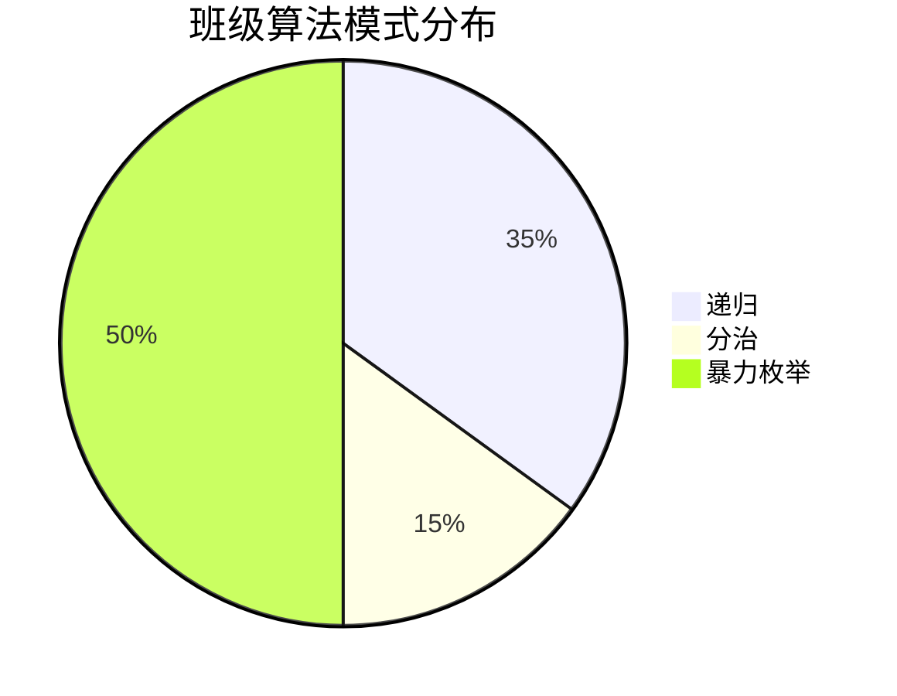

## **一. 生成式人工智能支持下的学科差异化教学评价体系构建与实践**

####  **核心研究内容**

**1. 生成式AI评价工具的开发与适配性研究**

-   深度：对比豆包、通义、文心、GLM等工具在学科评价中的表现，通过Prompt工程优化评价指令（如设计rubric驱动的提示词）
    
-   产出：建立信息学科专用的AI评价提示词库及使用规范

**2. 多维度教学评价模型的构建**

-   深度：将AI评价与传统评价结合，构建"知识掌握+思维过程+情感态度"三维评价框架
    
-   产出：集成使用语言大模型、多模态大模型，构建多智能体AI评价系统。在编程练习中，AI分析学生思路、伪代码、程序的逻辑性，结合教师观察和记录学生实操能力，系统自动生成综合评价雷达图

**3. 教师-AI协同评价的实践路径**

-   深度：探索"AI初评-教师复核-师生共议"的新型评价流程
    
-   产出：形成AI评价结果的二次加工策略，避免技术依赖导致的评价趋同化

---

## **二. 生成式AI赋能的初中信息科技编程能力评价体系构建——基于过程性数据与多模态反馈"**

### **推荐题目**

1.  《基于LLM的初中Python编程作业自动评价与认知缺陷诊断研究》
    
2.  《计算机视觉辅助的C++实操课堂表现动态评价系统开发与实践》
    
3.  《面向计算思维培养的双模态AI评价模型——代码静态分析+自然语言生成反馈》
    

----------

### **研究内容**

**1. 编程能力评价的AI Agent开发（发挥CV+LLM能力）**

-   构建混合评价模型：
```python
# 示例技术路线
def programming_evaluation(code_submission):
    # 思路诊断 （LLM分析学生思路伪代码）
    thinking_quality = thinking_analyzer(unreal_code)
    
    # 静态分析（利用AST解析等）
    code_quality = static_analyzer(code_submission)  
    
    # 动态测试（您已有的C++/Python评测系统）
    test_cases_pass = run_test_cases(code_submission)  
    
    # LLM语义分析（结合prompt工程）
    llm_feedback = ask_llm(f"""
        请从以下维度评价这段初中生代码：
        1. 算法逻辑合理性（1-5分）
        2. 代码可读性（缩进/命名等）
        3. 创新性表现
        附加改进建议（用初中生能理解的语言）""")
    
    return generate_radar_chart(code_quality, test_cases_pass, llm_feedback)
```
-   创新点：突破传统OJ系统仅判断对错的局限，增加**代码风格**和**思维过程**评价
    

**2. 编程学习过程的多模态数据采集（发挥计算机视觉专长）**

-   开发课堂行为分析插件：
    
    -   通过摄像头采集学生：
        
        -   屏幕操作流（VS Code/Pycharm等IDE的使用熟练度）
            
        -   面部表情识别（遇到bug时的困惑程度）
            
        -   键盘鼠标事件热力图（调试效率）
            
    -   与代码提交记录形成时空关联数据库

**3. 个性化学习路径生成（结合大模型应用能力）**

-   当系统检测到学生反复出现同类错误时（如循环条件错误）：
    
    1.  自动生成/检索微课视频（用GPT-4o合成讲解动画/LLM结合RAG检索微课视频）
        
    2.  推荐特定练习题（结合RAG，从题库中匹配相似度>85%的题目）
        
    3.  组建临时学习小组（聚类分析有相同薄弱点的学生）

**4. 评价效度的实证研究**

-   设计对照组实验：
    
    组别 | 评价方式|测量指标
    :-:|:-:|:-:
    A组|传统OJ批改+人工评价|代码正确率、学习兴趣问卷
	B组|AI基础评价| 同上+debug耗时统计
    C组|多模态AI评价|同上+摄像头注意力数据


### **技术实施关键点**

1.  **代码特征提取**：
    
    -   使用`pyastgrep`分析抽象语法树，检测代码坏味道
        
    -   用`CodeBERT`模型识别算法设计模式
        
2.  **教育提示词工程**：
```python
# 优于通用提示的学科专用设计
def make_prompt(student_code):
    return f"""你是一位经验丰富的信息科技教师，请用初中生能理解的语言：
    1. 找出代码中3个最关键问题（按重要性排序）
    2. 用'汉堡包反馈法'（肯定+改进+鼓励）书写评语
    3. 生成1个贴近学生生活的类比解释（如：这个死循环就像...）
    学生代码：{student_code}"""
```

3.  **伦理保护机制**：
    
    -   对采集的面部数据做边缘计算（不存储原始图像）
        
    -   设置AI评价的置信度阈值（<70%时自动转人工）
        

----------

### **预期成果**

1.  信息学科专用的**编程能力评价指标体系**（含代码质量、调试策略等维度）
    
2.  可复用的**Jupyter Notebook评价插件**（对接学校现有OJ系统）
    
3.  教师用**AI评价看板**（可视化每个学生的计算思维发展轨迹）
---

## 附： 一些具体实现方法
### **1. 使用pyastgrep分析AST检测代码坏味道**

#### **教育意义**

帮助初中生建立规范的编程风格，提前预防常见代码质量问题（如重复代码、过长函数等），适用于Python/C++作业批改。

#### **技术实现**
```python
import ast
from pyastgrep import search

# 示例：检测"魔法数字"坏味道
code = """
def calc_area(r):
    return 3.14 * r * r  # 魔法数字应定义为常量
"""

# 构建AST查询模式
pattern = """
//*[matches(n, "^\d+$") 
     and not(parent::Attribute/value/Name/@id='math')]
"""

# 执行检测
for node in search(pattern, code):
    print(f"第{node.lineno}行发现魔法数字: {ast.get_source_segment(code, node)}")

# 典型学校场景检测项：
bad_smells = {
    "重复代码": "//FunctionDef[count(//*[text()=current()/body//*])>3]",
    "过长参数列表": "//arguments[count(/args)>5]",
    "深层嵌套": "//If[count(ancestor::If)>3]"
}
```

#### **教学应用场景**

-   **作业自动评语**：  
    "你的代码在第7行使用了魔法数字3.14，建议改为`PI = 3.14`定义在文件开头"
    
-   **代码质量评分**：
```python
def code_quality_score(bad_smells_count):
    return max(0, 100 - bad_smells_count * 15)  # 每个坏味道扣15分
```

### **2. 使用CodeBERT识别算法设计模式**

#### **教育意义**

识别学生代码中隐含的算法思维（如递归、分治等），突破表面语法评价，真正评估计算思维水平。

#### **技术实现**
```python
from transformers import AutoModel, AutoTokenizer
import torch

# 加载教育领域微调后的CodeBERT
model = AutoModel.from_pretrained("microsoft/codebert-base")
tokenizer = AutoTokenizer.from_pretrained("microsoft/codebert-base")

# 示例：识别递归模式
student_code = """
def factorial(n):
    return 1 if n==0 else n*factorial(n-1)  # 典型递归
"""

inputs = tokenizer(student_code, return_tensors="pt")
with torch.no_grad():
    outputs = model(**inputs)
    
# 分类头预测（需提前微调）
pattern_logits = torch.nn.Linear(768, 5)(outputs.pooler_output)  # 5种教学模式
patterns = ["递归", "分治", "贪心", "DP", "暴力枚举"]
predicted_pattern = patterns[torch.argmax(pattern_logits)]

print(f"检测到算法模式: {predicted_pattern}")  # 输出：递归
```

#### **教学应用场景**

-   **思维可视化看板**：

- **个性化推荐**：  
检测到学生频繁使用"暴力枚举"时，自动推送分治算法微课。

### **技术对比表**

维度|pyastgrep (AST分析)|CodeBERT (模式识别)
:-:|:-:|:-:|
**分析层次** |语法结构层面|语义意图层面
**适用阶段**|代码提交后的静态检查|编程过程中的实时分析
**计算开销**|低（规则匹配）|高（需要GPU推理）
**教学价值**|培养编程规范|发展计算思维
**典型输出**|"检测到未处理的异常"|"这段代码体现了回溯思想"

### **教育化改进建议**

1.  **AST分析的友好输出**：  
    将错误类型映射为初中生能理解的语言：
   ```python
error_mapping = {
    "MagicNumber": "请给这个数字起个有意义的变量名",
    "DeepNesting": "嵌套太多层了，试试拆分成小函数"
}
```

2. **CodeBERT的教学适配**：  
在微调时加入学生常见代码样本：
```python
# 学生典型递归实现（与工业级代码差异大）
student_samples = [
    ("def sum(n): return n+sum(n-1)", "递归"),
    ("for i in range(10): print(i)", "迭代") 
]
```

3. **可视化辅助**：
```python
# 生成AST结构图帮助学生理解
import astor
tree = ast.parse(code)
print(astor.dump_tree(tree))  # 可转换为图形化显示
```

<!--stackedit_data:
eyJoaXN0b3J5IjpbLTE1NDY2NjQyMTksLTEyOTczMTI1MDUsLT
Y3MzI2MjYyOSwtODg2MzM1MTMyLDE2NjY1MjU3NSwtOTQ2ODYy
MTY3XX0=
-->